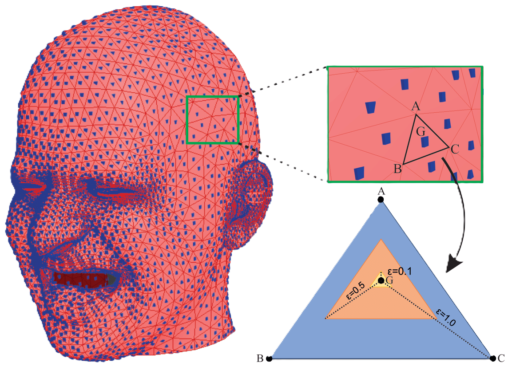
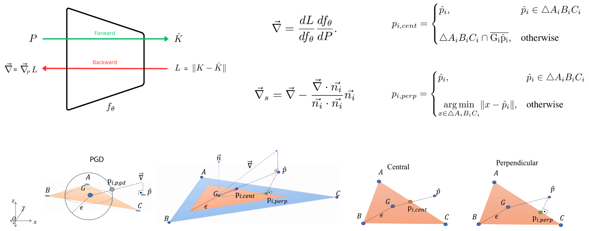

# ∊-Mesh Attack: A Surface-based Adversarial Point Cloud Attack for Facial Expression Recognition

[Batuhan Cengiz](https://batuceng.github.io/), [Mert Gülşen](https://github.com/qwertymert), [Yusuf H. Sahin](https://scholar.google.com.tr/citations?user=62rdgoYAAAAJ&hl), [Gozde Unal](https://gozde-unal.github.io/) <br />

The official repository for the titled [IEEE FG 2024](https://fg2024.ieee-biometrics.org/) paper: [[`IEEE`](https://ieeexplore.ieee.org/abstract/document/10581993)] [[`arxiv`](https://arxiv.org/abs/2403.06661)]

## Abstract

<table>
  <tr>
    <td></td>
    <td></td>
  </tr>
</table>

Point clouds and meshes are widely used 3D data structures for many computer vision applications. While the meshes represent the surfaces of an object, point cloud represents sampled points from the surface which is also the output of modern sensors such as LiDAR and RGB-D cameras. Due to the wide application area of point clouds and the recent advancements in deep neural networks, studies focusing on robust classification of the 3D point cloud data emerged. To evaluate the robustness of deep classifier networks, a common method is to use adversarial attacks where the gradient direction is followed to change the input slightly. The previous studies on adversarial attacks are generally evaluated on point clouds of daily objects. However, considering 3D faces, these adversarial attacks tend to affect the person's facial structure more than the desired amount and cause malformation. Specifically for facial expressions, even a small adversarial attack can have a significant effect on the face structure. In this paper, we suggest an adversarial attack called ϵ-Mesh Attack, which operates on point cloud data via limiting perturbations to be on the mesh surface. We also parameterize our attack by ϵ to scale the perturbation mesh. Our surface-based attack has tighter perturbation bounds compared to L2 and L∞ norm bounded attacks that operate on unit-ball. Even though our method has additional constraints, our experiments on CoMA, Bosphorus and FaceWarehouse datasets show that ϵ-Mesh Attack (Perpendicular) successfully confuses trained DGCNN and PointNet models 99.72% and 97.06% of the time, with indistinguishable facial deformations.

## Installation
The required Python libraries should be installed.

```bash
pip install -r requirements.txt
```

## Citation
If you find our work helpful, please consider citing:

```bibtex
@INPROCEEDINGS{10581993,
  author={Cengiz, Batuhan and Gülşen, Mert and Sahin, Yusuf H. and Unal, Gozde},
  booktitle={2024 IEEE 18th International Conference on Automatic Face and Gesture Recognition (FG)}, 
  title={∊-Mesh Attack: A Surface-based Adversarial Point Cloud Attack for Facial Expression Recognition}, 
  year={2024},
  volume={},
  number={},
  pages={1-9},
  keywords={Point cloud compression;Three-dimensional displays;Limiting;Laser radar;Perturbation methods;Gesture recognition;Robustness},
  doi={10.1109/FG59268.2024.10581993}}
```
